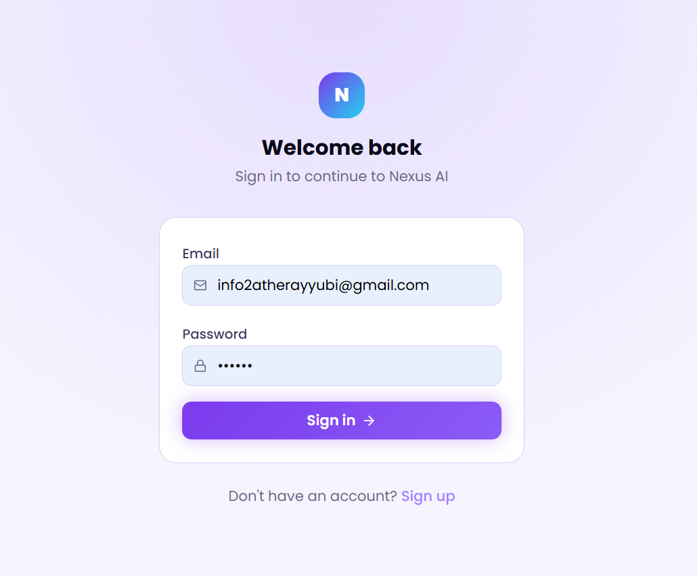
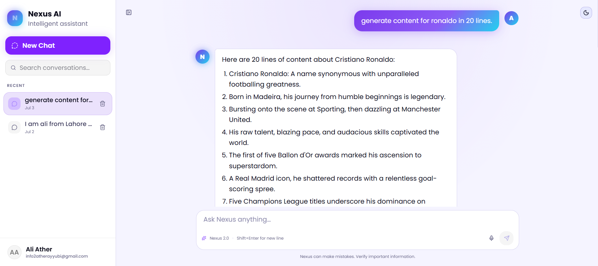

# Nexus AI — Full Stack AI Chatbot

A production-ready AI chatbot application built with **Next.js 16**, **Supabase**, and **Google Gemini API**. Features real-time streaming responses, full authentication, persistent chat history, RAG-powered PDF document chat, dark/light theme, and a polished animated UI.


---

## ✨ Features

### 🤖 AI & Chat
- **Real-time streaming** responses from Google Gemini 2.0 Flash
- **RAG (Retrieval Augmented Generation)** — upload PDFs and chat with your documents
- Animated streaming cursor and loading indicators
- Markdown rendering — supports headings, lists, code blocks, tables, bold/italic
- Copy, like/dislike, and regenerate message actions

### 🔐 Authentication
- Email & password signup / login via Supabase Auth
- Email confirmation flow
- Protected routes via Next.js middleware
- Auto-redirect to login for unauthenticated users

### 💾 Data Persistence
- Full chat history saved to Supabase PostgreSQL
- Conversations and messages persist across sessions and devices
- Row Level Security (RLS) — users only access their own data
- Auto-delete cascades (deleting a conversation removes all its messages)

### 🎨 UI/UX
- Dark / Light theme toggle with system preference detection
- Collapsible animated sidebar with conversation list and search
- Delete conversations with confirmation
- Responsive design — works on desktop and mobile
- Framer Motion animations throughout
- Custom color and font-size design token system

### 📄 RAG — PDF Document Chat
- Upload PDF files per conversation
- Automatic text extraction and chunking
- Vector embeddings via Gemini `text-embedding-004`
- Similarity search via Supabase `pgvector`
- Gemini answers questions grounded in your document content

---

## 🛠 Tech Stack

| Layer | Technology |
|---|---|
| Framework | Next.js 16 (App Router, Turbopack) |
| Language | TypeScript |
| Styling | Tailwind CSS v4 + CSS custom properties |
| UI Components | shadcn/ui (base-ui) |
| Animations | Framer Motion |
| AI / LLM | Google Gemini API (`@google/genai`) |
| Embeddings | Gemini `text-embedding-004` |
| Auth | Supabase Auth |
| Database | Supabase PostgreSQL + pgvector |
| ORM | Supabase JS Client |
| Markdown | react-markdown + remark-gfm |
| PDF Parsing | pdf-parse |
| Deployment | Vercel |

---

## 📁 Project Structure

```
src/
├── app/
│   ├── login/               # Login page
│   ├── signup/              # Signup page
│   ├── auth/callback/       # Email confirmation handler
│   └── api/
│       ├── gemini/          # Streaming Gemini API route + RAG
│       ├── conversations/   # CRUD for conversations
│       │   └── [id]/
│       │       ├── route.ts         # DELETE conversation
│       │       └── messages/route.ts # GET + POST messages
│       └── documents/
│           └── upload/      # PDF upload + embedding pipeline
├── components/
│   ├── chat/
│   │   ├── ChatArea.tsx     # Main chat area + empty state
│   │   ├── ChatInput.tsx    # Input box with toolbar
│   │   ├── MessageBubble.tsx # Markdown message renderer
│   │   └── PDFUploadButton.tsx # PDF upload with progress
│   ├── sidebar/
│   │   └── Sidebar.tsx      # Collapsible sidebar + search
│   ├── layout/
│   │   └── ChatLayout.tsx   # Root layout with theme toggle
│   ├── profile.tsx          # Profile dropdown with auth
│   └── ui/                  # shadcn components
├── hooks/
│   ├── useChat.ts           # Chat state + API calls
│   ├── useAuth.ts           # Auth state + sign out
│   └── useTheme.ts          # Dark/light theme
├── lib/
│   └── supabase/
│       ├── client.ts        # Browser Supabase client
│       ├── server.ts        # Server Supabase client
│       └── middleware.ts    # Session refresh middleware
├── utils/
│   ├── colors.ts            # Color design tokens
│   ├── fontsize.ts          # Typography design tokens
│   └── index.ts             # Shared utilities
├── types/
│   └── index.ts             # TypeScript interfaces
└── middleware.ts             # Route protection
```

---

## 🚀 Getting Started

### Prerequisites
- Node.js 18+
- A [Supabase](https://supabase.com) account (free tier works)
- A [Google AI Studio](https://aistudio.google.com) API key

### 1. Clone the repository

```bash
git clone https://github.com/aliatherayyubi/nexus-ai.git
cd nexus-ai
```

### 2. Install dependencies

```bash
npm install
```

### 3. Set up Supabase

1. Create a new project at [supabase.com](https://supabase.com)
2. Go to **SQL Editor** → **New Query** → paste and run the schema below
3. Go to **Project Settings → API** and copy your keys

<details>
<summary>📋 Click to expand SQL schema</summary>

```sql
-- Enable vector extension for RAG
create extension if not exists vector;

-- Conversations
create table conversations (
  id uuid primary key default gen_random_uuid(),
  user_id uuid not null references auth.users(id) on delete cascade,
  title text not null,
  created_at timestamptz not null default now(),
  updated_at timestamptz not null default now()
);

-- Messages
create table messages (
  id uuid primary key default gen_random_uuid(),
  conversation_id uuid not null references conversations(id) on delete cascade,
  role text not null check (role in ('user', 'assistant')),
  content text not null,
  created_at timestamptz not null default now()
);

-- Documents (for RAG)
create table documents (
  id uuid primary key default gen_random_uuid(),
  user_id uuid not null references auth.users(id) on delete cascade,
  conversation_id uuid references conversations(id) on delete cascade,
  name text not null,
  size integer,
  created_at timestamptz default now()
);

-- Document chunks with embeddings
create table document_chunks (
  id uuid primary key default gen_random_uuid(),
  document_id uuid not null references documents(id) on delete cascade,
  user_id uuid not null references auth.users(id) on delete cascade,
  content text not null,
  embedding vector(768),
  chunk_index integer,
  created_at timestamptz default now()
);

-- Enable RLS
alter table conversations enable row level security;
alter table messages enable row level security;
alter table documents enable row level security;
alter table document_chunks enable row level security;

-- RLS Policies
create policy "Users manage their own conversations"
  on conversations for all using (auth.uid() = user_id);

create policy "Users manage messages in their conversations"
  on messages for all using (
    exists (select 1 from conversations where id = messages.conversation_id and user_id = auth.uid())
  );

create policy "Users manage their own documents"
  on documents for all using (auth.uid() = user_id);

create policy "Users manage their own chunks"
  on document_chunks for all using (auth.uid() = user_id);

-- Vector similarity search function
create or replace function match_chunks(
  query_embedding vector(768),
  match_user_id uuid,
  match_conversation_id uuid,
  match_count int default 5
)
returns table (id uuid, content text, similarity float)
language sql stable as $$
  select id, content, 1 - (embedding <=> query_embedding) as similarity
  from document_chunks
  where user_id = match_user_id
    and document_id in (
      select id from documents where conversation_id = match_conversation_id
    )
  order by embedding <=> query_embedding
  limit match_count;
$$;

-- Auto-update updated_at
create or replace function update_updated_at()
returns trigger as $$
begin new.updated_at = now(); return new; end;
$$ language plpgsql;

create trigger conversations_updated_at
  before update on conversations
  for each row execute function update_updated_at();
```

</details>

### 4. Configure environment variables

Create a `.env.local` file in the project root:

```env
# Supabase
NEXT_PUBLIC_SUPABASE_URL=https://your-project.supabase.co
NEXT_PUBLIC_SUPABASE_ANON_KEY=your-anon-key

# Google Gemini
GEMINI_API_KEY=your-gemini-api-key
```

### 5. Run the development server

```bash
npm run dev
```

Open [http://localhost:3000](http://localhost:3000) — you'll be redirected to the login page.

---

## 🌐 Deployment (Vercel)

```bash
npm install -g vercel
vercel
```

Add these environment variables in **Vercel Dashboard → Project → Settings → Environment Variables**:

```
NEXT_PUBLIC_SUPABASE_URL
NEXT_PUBLIC_SUPABASE_ANON_KEY
GEMINI_API_KEY
```

Then redeploy:

```bash
vercel --prod
```

---

## 📸 Screenshots





---

## 🧠 Architecture Highlights

### Streaming Architecture
```
User Input → Next.js API Route → Gemini generateContentStream()
           → ReadableStream → Frontend reader.read() loop
           → Real-time UI updates per chunk
```

### RAG Pipeline
```
PDF Upload → pdf-parse (text extraction) → chunk splitting (500 chars)
           → Gemini text-embedding-004 → pgvector storage
Query      → embed question → cosine similarity search
           → top 5 chunks injected into Gemini prompt → streaming answer
```

### Auth Flow
```
Request → Next.js Middleware → Supabase session check
        → Authenticated: continue
        → Unauthenticated: redirect /login
```

---

## 👨‍💻 Author

**Ali** — AI Automation Engineer & Full Stack Developer

- Upwork: [Ali Ather](https://www.upwork.com/freelancers/~01279ddc155167c876?mp_source=share)
- GitHub: [@aliatherayyubi](https://github.com/AliAtherAyyubi)
- LinkedIn: [Ali Ather](https://www.linkedin.com/in/ali-ather-dev)

---

## 📄 License

MIT License — feel free to use this project as a reference or starting point.

---

<div align="center">
  <p>Built with ❤️ using Next.js, Supabase, and Google Gemini</p>
  <p>⭐ Star this repo if you found it helpful!</p>
</div>